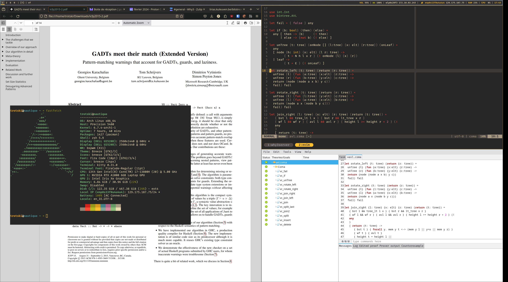

# My dotfiles

Made by [Paul](https://github.com/paulpatault/)

Based on the [Gruvbox](https://github.com/morhetz/gruvbox) color scheme.

## Information

- **OS:** [ArchLinux](https://archlinux.org/)
- **WM:** [bspwm](https://github.com/baskerville/bspwm)
- **Shortcuts deamon:** [sxhkd](https://github.com/baskerville/sxhkd)
- **Terminal Emulator:** [Kitty](https://sw.kovidgoyal.net/kitty/)
- **Status Bar:** [Polybar](https://github.com/polybar/polybar)
- **Notification Daemon:** [Dunst](https://github.com/dunst-project/dunst)
- **App launcher:** [Rofi](https://github.com/davatorium/rofi)
- **Shell:** [zsh](https://www.zsh.org/)
- **Shell Plugin Manager:** [OhMyZsh](https://ohmyz.sh/)
- **Shell Theme:** [Spaceship](https://spaceship-prompt.sh/)
- **Text Editor:** [Neovim](https://neovim.io/)
- **Browser:** [Firefox](https://www.mozilla.org/en-US/firefox/)
- **Font:** [Fira Code](https://github.com/tonsky/FiraCode)

<!-- - **Compositor:** [Picom](https://github.com/yshui/pwmicom) -->
<!-- - **File Manager:** [Thunar](https://wiki.archlinux.org/title/Thunar) -->
<!-- (https://librewolf.net/) -->

## Pictures

> WIP (forever)

